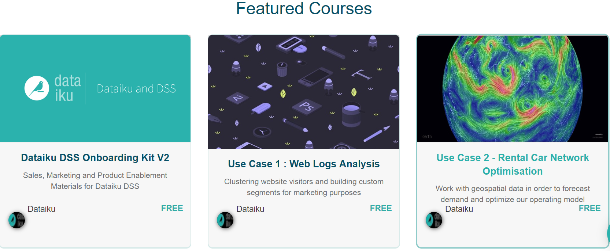

# DECOUVRIR DATAIKU

#### Qu'est ce que Dataiku?

Dataiku est une société américaine spécialisée dans la science de la donnée. La plateforme de Data science Dataiku DSS propose aux équipes de professionnels de la data de collaborer au sein d’un même environnement. Elle permet non seulement le traitement analytique des données, mais également le développement de nouvelles solutions allant de la data visualisation en passant par le stockage et la modélisation. Son approche collaborative permet d’aider les spécialistes au sein d’une équipe de l’utiliser pour : explorer, analyser, développer ou encore produire des données de manière optimale. 

Dataiku DSS est un outil tout-en-un qui permet de produire un projet de la préparation au déploiement. Cet environnement accorde l’utilisation des standards et langages lié au Big Data.

#### Comment se former à Dataiku ? Quel tutoriel faire ?

Afin de se former à utiliser la plateforme, Dataiku a mis en œuvre son propre système d’apprentissage gratuit, en passant par différents tutoriels ainsi que des vidéos en fonction du besoin et des compétences.

Une rubrique « Getting Started » est disponible pour les débutants, on y trouve plusieurs vidéos ainsi que trois tutoriels en partant des premiers pas sur la plateforme (création du projet, du dataset, exploration de données, visualisation, etc…) jusqu’au déploiement des différentes méthodes de Machine Learning (création et  amélioration d’un modèle, puis la création d’une application où l’on peut tester le modèle sur de nouvelles données) en passant par les différentes manipulations à effectuer pour la transformation des données.

Une deuxième rubrique est disponible pour les amateurs ou les professionnels qui souhaitent se former sur un sujet en particulier, sous forme de vidéos YouTube d’environ 5min : Importation, Préparation des données, Data Visualisation, Code, Machine Learning, Automatisation, Scoring en temps réel, Administration, etc…

Une troisième rubrique contenant des uses cases est disponible afin de s’entrainer sur différents sujets plus concrets notamment : Clustering, Deep Learning, Application Web, classification de texte et d’image, analyse de sentiment, et d’autres problématiques.  

#### Durée du E-LEARNING

Une version d’essai du logiciel est disponible sur le site Dataiku (20 jours d’essai) qui donne accès à la plateforme depuis internet.

**Les sites de E-learning**

Sur [Dataiku](https://www.dataiku.com/learn/)

* 13 tutoriels disponibles dans la rubrique « How's to » sur le site de Dataiku  dont 7 pour débutant (apprendre les bases,Sql dans Dataiku,apprentissage Machine Learning etc…).

* Plus d'une dizaine d’heures de vidéo pour commencer à se former sur Dataiku et apprendre à réaliser des traitements spécifiques

* Des exemples de projets pour connaître les possibilités d’utilisations de la plateforme en fonction des problématiques rencontrées.

* Possibilité d'assister à des démos en live le Mercredi à 12h, qui présente les fonctionnalités de base.

Sur [Dataiku TeachTable](http://dataiku.teachable.com)

Ce site donne un aperçu plus détaillé des fonctionnalités et de la proposition de valeur de la plateforme. On y retrouve également des projets de plus en plus complexes à réaliser dans DSS en avançant pas à pas dans la réalisation.

Exemple: How to analyze sales figures for the Dataiku T-shirt company

#### Quels sont les profils utilisateurs de Dataiku?

La plateforme Dataiku offre aux **professionnels des données** des solutions pour  traiter , visualiser , analyser ou modéliser les données qui peuvent provenir de différentes sources (SQL Data base,Cloud etc...)

Par professionnels de données ,on désigne : les Data Analyst, les Data Scientist et  les Data Engineer.

* Pour les **Data Analyst**, Dataiku DSS propose une interface visuelle interactive qui donne la possibilité cliquer, pointer  et développer dans des langages comme SQL,Python, R ,Scala, PySpark... Il est aussi possible de confronter des données, réaliser des modèles (prédictifs ou de classification) sur les données, de relancer les workflows, visualiser les résultats, et obtenir des insights sur demande.

* Pour les **Data Scientist** et les **développeurs**,Dataiku DSS permet de préparer et de modéliser aisément et rapidement les données . Elle aide également à améliorer les bibliothèques ML comme scikitlearn, R, MLlib, ou H2O. Cet ensemble d'opportunités est offert par l'automatisation des tâches par le biais d’une interface entièrement personnalisable.

* Pour les **Data Engineer**, Dataiku DSS permet de coordonner tout le développement et toutes les opérations grâce à l'automatisation du workflow, de créer des services web prédictifs, et de monitorer la surveillance du statut des données et des modèles au quotidien.

#### Quelle certification DATAIKU ? Combien coûte la certification ?

**La certification DATAIKU DSS**

**Comment préparer la certification ?**

Il n’existe qu’une seule certification DATAIKU DSS, disponible sur le site DATAIKU.

 Pour préparer la certification, DATAIKU  met à dispositon une plateforme de e-learning qui contient :

· Un aperçu détaillé des fonctionnalités et de la proposition de valeur de la plateforme

· Des projets différents en fonction de la difficulté

En complément, voici une liste de ressources qui peut être utilisée dans le cadre de la prise en main de DSS:

* Le guide utilisateur :

<https://www.dataiku.com/learn/>

* La documentation de référence:

<https://doc.dataiku.com/dss/latest>

* Un site de question réponse:

http://answers.dataiku.com/

* La chaîne YouTube de DATAIKU :

<https://www.youtube.com/channel/UCSMqVwPTmerMiCaL_zKRjBw>

**Comment passer la certification ?**

Pour passer la certification, il suffit de s'inscrire sur le site Dataiku et de remplir un [formulaire](https://www.dataiku.com/learn/portals/online-certification.html).

Le test, entièrement en ligne, comporte 2 parties (à réaliser de préférence en une fois):

Une première partie théorique qui contient 50 questions à choix multiples, couvrant les fonctionnalités principales de DSS. Elle est limitée à 45 min et le score à atteindre est de 60%.

Type de question de la certification:

La deuxième partie consiste à réaliser un challenge Kaggle dans DSS, incluant des questions ouvertes sur la réalisation du projet (il faut penser à préparer ses questions pendant la construction du projet DSS). Les instructions du Kaggle  sont indiquées à la fin du QCM.

Ce n’est qu’après l’envoi du screenshot du score Kaggle et du projet DSS zippé à l’adresse  [certification@dataiku.com](mailto:certification@dataiku.com), que  l’équipe DATAIKU  revient rapidement avec les résultats.

 De plus, il est obligatoire de réussir la première partie de la certification pour avoir accès à la réalisation du challenge Kaggle.
